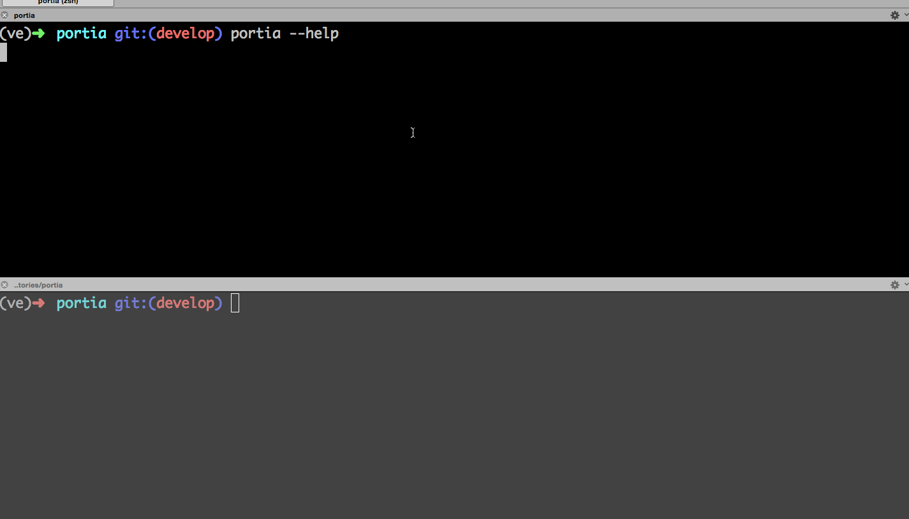

.. Portia documentation master file, created by
   sphinx-quickstart on Tue Oct 13 08:44:37 2015.
   You can adapt this file completely to your liking, but it should at least
   contain the root `toctree` directive.

Portia
======

A small service that allows one to:

- lookup phone numbers in number porting databases.
- annotate records with extra information when needed.

Installation
------------

First make sure you have Redis installed and running:

::

   $ apt-get install redis-server

::

   $ virtualenv ve
   $ source ve/bin/activate
   (ve)$ pip install portia
   (ve)$ portia --help

Importing database files
------------------------

::

   (ve)$ portia import porting-db path/to/file.csv

Running the server
------------------

::

   (ve)$ portia run

Querying
--------

Looking up everything for a known phone number::

   $ curl http://localhost:8000/lookup/27123456780
   {
     "ported-to-timestamp": "2015-10-11T00:00:00",
     "ported-from": "MNO1",
     "ported-to": "MNO2",
     "ported-from-timestamp": "2015-10-11T00:00:00"
   }

Looking up a single key for a phone number::

   $ curl http://localhost:8000/lookup/27123456780/ported-to
   {
     "ported-to": "MNO2",
     "ported-to-timestamp": "2015-10-11T00:00:00"
   }

Annotating
----------

Portia has a number of defined annotations that it supports, these are:

- observed-network
- ported-from
- ported-to
- do-not-call

Adding an observed network annotation for a phone number::

   $ curl -XPUT -d MNO3 http://localhost:8000/annotate/27123456780/observed-network
   "MNO3"

   $ curl http://localhost:8000/lookup/27123456780/observed-network
   {
     "ported-to": "MNO2",
     "ported-to-timestamp": "2015-10-11T00:00:00",
     "ported-from": "MNO1",
     "ported-from-timestamp": "2015-10-11T00:00:00",
     "observed-network": "MNO3",
     "observed-network-timestamp": "2015-10-13T06:54:18.797250"
   }

Custom annotations are allowed if the key is prefixed with ``X-``::

   $ curl -XPUT -d bar http://localhost:8000/annotate/27123456780/X-foo
   "bar"
